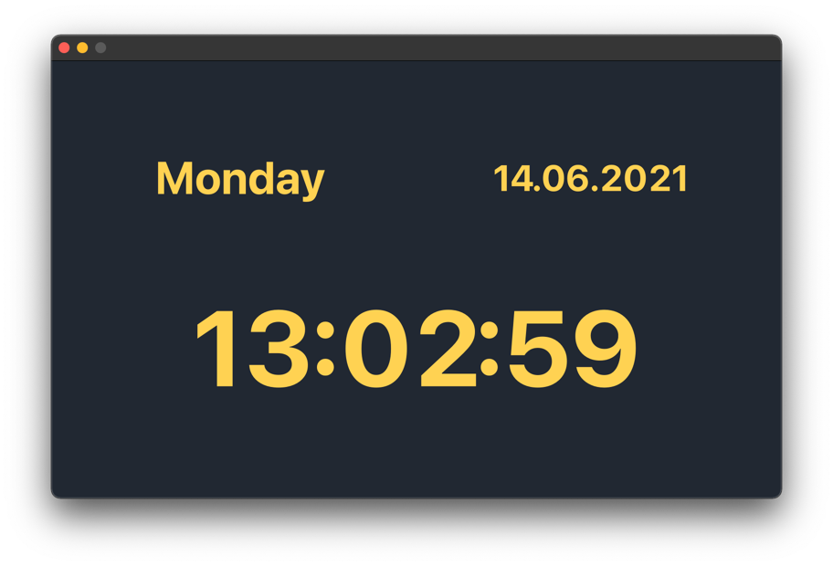
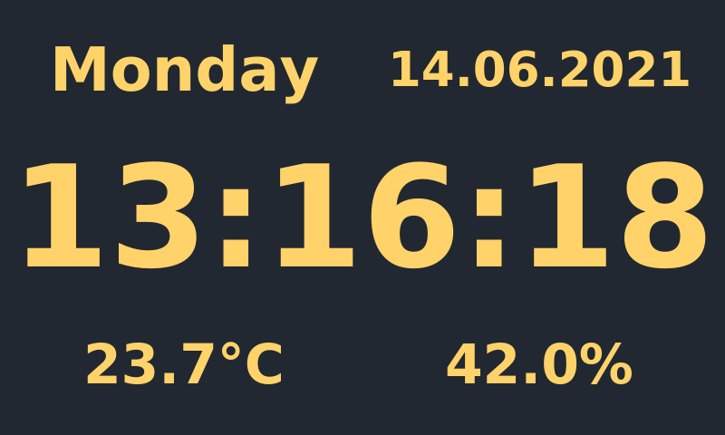

# Desk-Clock

This is a simple desk-clock designed for small displays (5 inch) which supports temperature sensors.





## Prerequisites

Install the requirements. 

Hint: you don't need *adafruit_dht* and *board* if you don't want to use a temperature sensor.

## How to use?

Run ```python3 main.py```.

If you want to use the temperature sensor 
(make sure *adafruit_dht* and *board* are installed) run ```python3 main.py --temp```.

## Additional information